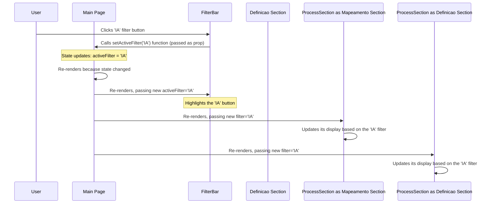

# Chapter 1: Main Page (`ProductProcess`)

Welcome to the tutorial for the `processo-produto-foco-folego-ia` project! We're excited to guide you through how this visualization of an AI-assisted product process works.

Imagine you want to build a webpage that shows a complex process, like building a digital product. You want to break it down into big phases ("Compreensão", "Definição", "Implementação") and smaller steps within each phase. You also want users to be able to maybe hide or show details for each phase, or filter the steps to only see those related to, say, "AI Assistance". How would you organize all of this on one page?

That's exactly the job of our **Main Page**, the `ProductProcess` component!

Think of `ProductProcess` as the **stage director** for our web page. It doesn't act out the scenes itself, but it knows:

1.  **The Script:** It has access to all the data describing the product process (`processData`).
2.  **The Actors:** It knows about the different UI components (like the sections for each phase, the filter bar, etc.).
3.  **The Scene:** It decides which actors (components) appear on the stage (the web page), where they go, and what information (props) they need to perform their roles.
4.  **The Current State:** It keeps track of things like which sections are currently expanded or collapsed, and if any filter is active.

## What `ProductProcess` Does

The `ProductProcess` component, located in `app/page.tsx`, is the heart of the user interface. Its main responsibilities are:

1.  **Loading Data:** It imports the core data (`processData`) that defines all the stages and steps of the product process. We'll explore this data structure later in [Chapter 4: Product Process Data Structure](04_product_process_data_structure_.md).
2.  **Managing State:** It uses React's `useState` hook to keep track of how the user is interacting with the page:
    *   `expandedSections`: Remembers which main process sections ("compreensao", "definicao", "implementacao") are open or closed.
    *   `isFolegoExpanded`: Remembers if the special "Fôlego" section is open or closed.
    *   `activeFilter`: Remembers which filter (like "IA" or "PO") is currently selected by the user.
3.  **Arranging Components:** It renders the different visual parts (components) of the page in the correct order and layout. This includes:
    *   The main title and introduction images.
    *   The [`FilterBar`](05_filtering_logic_.md) component, which acts as both a filter control and a legend.
    *   The main process sections, displayed using the [`ProcessSection`](02__processsection__component_.md) component for "Compreensão" and "Definição", and the [`ImplementationSection`](07__implementationsection__component_.md) for "Implementação".
    *   The [`FolegoSection`](06__folegosection__component_.md) component, displayed alongside the main process.
    *   Other helper components like `AutomationHighlight` and `ResourcesSection`.
4.  **Passing Information (Props):** It gives each component the specific data and state information it needs. For example, it tells a `ProcessSection` *which* part of the `processData` to display, whether it should *be* expanded (`isExpanded`), what *function* to call when the user tries to toggle it (`onToggle`), and what the currently *active filter* is (`filter`).

## A Look at the Code

Let's peek inside `app/page.tsx` to see how `ProductProcess` is set up. Don't worry if not everything makes sense yet – we'll break it down.

```typescript
// File: app/page.tsx (Simplified)
"use client" // Required for using state and effects in Next.js

import { useState } from "react"
import { processData } from "@/data" // 1. Import the process data
// 2. Import the components (actors)
import { ProcessSection } from "@/components/process-section"
import { FolegoSection } from "@/components/folego-section"
import { FilterBar } from "@/components/filter-bar"
// ... other imports

export default function ProductProcess() {
  // 3. Manage state: expanded sections, folego section, active filter
  const [expandedSections, setExpandedSections] = useState<Record<string, boolean>>({ /* ... initial state ... */ })
  const [isFolegoExpanded, setIsFolegoExpanded] = useState(false)
  const [activeFilter, setActiveFilter] = useState<string | null>(null)

  // Function to toggle sections (we pass this down to ProcessSection)
  const toggleSection = (section: string) => { /* ... logic to update state ... */ }

  return (
    <div /* ... page layout ... */ >
      <h1 /* ... title ... */ >Processo de Produto com IA</h1>
      {/* ... Intro Images ... */}

      {/* 4. Render the Filter Bar, passing state and update function */}
      <FilterBar activeFilter={activeFilter} setActiveFilter={setActiveFilter} />

      {/* ... Automation Highlight ... */}

      <div className="flex flex-col lg:flex-row gap-4 mb-8"> {/* Main layout container */}
        <div /* ... Focus section container ... */ >
          {/* ... Focus Title ... */}
          <div className="p-4">
            {/* 5. Render Process Sections, passing data, state, and toggle function */}
            <ProcessSection
              title="mapeamento de oportunidades"
              data={processData.compreensao} // Pass relevant data
              isExpanded={expandedSections.compreensao} // Pass expansion state
              onToggle={() => toggleSection("compreensao")} // Pass toggle handler
              filter={activeFilter} // Pass active filter
            />
            {/* ... other ProcessSections (Definição) ... */}
            {/* ... ImplementationSection ... */}
          </div>
        </div>

        {/* 6. Render Folego Section */}
        <FolegoSection
          data={processData.folego}
          isExpanded={isFolegoExpanded}
          onToggle={() => setIsFolegoExpanded(!isFolegoExpanded)}
          emoji="🧘"
        />
      </div>
      {/* ... Resources Section ... */}
    </div>
  )
}
```

**Explanation:**

1.  **Import Data:** We bring in the `processData` which contains all the text and details for our product process visualization.
2.  **Import Components:** We import the building blocks (`ProcessSection`, `FilterBar`, etc.) that `ProductProcess` will arrange.
3.  **Manage State:** `useState` is used to create state variables (`expandedSections`, `isFolegoExpanded`, `activeFilter`) and functions to update them (`setExpandedSections`, `setIsFolegoExpanded`, `setActiveFilter`). This allows the page to react to user interactions.
4.  **Render Filter Bar:** We place the `FilterBar` component and pass it the current `activeFilter` state (so it knows which button to highlight) and the `setActiveFilter` function (so it can tell `ProductProcess` when the user clicks a filter).
5.  **Render Process Sections:** For each phase of the process (like "mapeamento de oportunidades"), we render a `ProcessSection`. We pass it the relevant `data` from `processData`, its specific expansion `isExpanded` state, the `toggleSection` function so it can ask `ProductProcess` to open/close it, and the `activeFilter` so it knows which steps to potentially highlight or hide.
6.  **Render Folego Section:** We render the `FolegoSection`, similarly passing it data, its expansion state, and a function to toggle it.

## How It Works: Behind the Scenes

Let's trace what happens when you interact with the page, for example, by clicking a filter button.

**Scenario:** User clicks the "IA" filter button.



**Step-by-step:**

1.  **User Action:** You click the "IA" button inside the `FilterBar` component.
2.  **Callback:** The `FilterBar` was given the `setActiveFilter` function from `ProductProcess` as a prop. It calls this function with the value `'IA'`.
3.  **State Update:** `ProductProcess` receives the call and updates its `activeFilter` state variable to `'IA'`.
4.  **Re-render:** Because its state changed, React tells `ProductProcess` to re-render itself and its children.
5.  **Prop Drilling:** During the re-render, `ProductProcess` passes the *new* value of `activeFilter` (`'IA'`) down as a prop to the `FilterBar` (which might use it to highlight the button) and to all the `ProcessSection` and `ImplementationSection` components.
6.  **Child Update:** Each `ProcessSection` receives the new `filter='IA'` prop. It then uses this information internally to decide which steps to show or highlight. We'll see how this filtering works in detail in [Chapter 5: Filtering Logic](05_filtering_logic_.md).

A similar process happens when you click to expand or collapse a section, but using the `expandedSections` state and the `toggleSection` function. The key idea is that `ProductProcess` holds the "single source of truth" for the application's state and passes it down to the components that need it.

## Conclusion

You've now met the **Main Page (`ProductProcess`)**, the central orchestrator of our application. It's like the director bringing together the data (script), components (actors), and state (current scene status) to create the final interactive visualization. It manages the overall state and tells the other components what data to show and how to behave.

Now that we understand how the main page is structured, let's zoom in on one of its key actors. In the next chapter, we'll explore the [`ProcessSection` Component](02__processsection__component_.md), which is responsible for displaying each major phase of the product development process.

---

Generated by [AI Codebase Knowledge Builder](https://github.com/The-Pocket/Tutorial-Codebase-Knowledge)