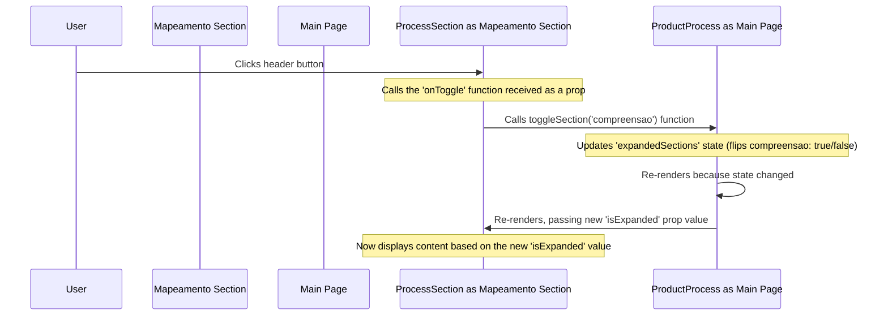

# Chapter 2: `ProcessSection` Component

In the [previous chapter](01_main_page___productprocess___.md), we met the `ProductProcess` component – the overall director of our product process visualization page. It loads all the data and decides which major components to show, like the filter bar and the sections for each process phase.

But how does each *major phase* (like "mapeamento de oportunidades" or "definição de solução") get displayed? How does it know *what* specific steps (stages) belong to it? How does it handle being opened or closed, and how does it know which steps to show if a filter is active?

This is where the `ProcessSection` component comes in!

## Meet the Section Manager

Think of the `ProductProcess` page as a large exhibition hall showing the entire product development journey. The `ProcessSection` component is like the manager of a specific **section** or **booth** within that hall.

*   **Specific Focus:** Each `ProcessSection` manager is only responsible for *one* major phase (e.g., "mapeamento de oportunidades"). It doesn't worry about other phases.
*   **Receives Instructions:** The main director (`ProductProcess`) tells the section manager (`ProcessSection`) *what* content (data) to display for its specific phase, whether its section should be *open* or *closed*, and if any special *filter* is active across the whole exhibition.
*   **Manages its Display:** Based on these instructions, the `ProcessSection` manager:
    *   Puts up a sign (displays the title and description).
    *   Decides whether to show the detailed exhibits (the individual steps, represented by [`StageCard` Component](03__stagecard__component_.md)s) based on whether it's told to be open or closed.
    *   Arranges its exhibits (the `StageCard`s) neatly in a row.
    *   If a filter is active (like "Show only AI-related steps"), it only displays the relevant exhibits.
*   **Reports Back:** When someone clicks on the section's header to open or close it, the `ProcessSection` manager tells the main director (`ProductProcess`) about this request.

## What `ProcessSection` Needs (Props)

To do its job, the `ProcessSection` needs specific information passed down from its boss, the `ProductProcess` component. This information is passed as **props**. Think of props as work orders or instruction sheets.

Here are the main props `ProcessSection` expects:

*   `title`: (Text) The name of the process phase (e.g., `"mapeamento de oportunidades"`).
*   `emoji`: (Text, Optional) An emoji to display next to the title (e.g., `"🔍"`).
*   `description`: (Text, Optional) A short explanation of this phase.
*   `data`: (Object) The actual data containing the list of steps (`stages`) for *this specific phase*. We'll look closer at this data in [Chapter 4: Product Process Data Structure](04_product_process_data_structure_.md).
*   `isExpanded`: (Boolean - `true` or `false`) Tells the section whether it should be open (`true`) or closed (`false`). This comes from the state managed by `ProductProcess`.
*   `onToggle`: (Function) A function provided by `ProductProcess`. When the user clicks the section header, `ProcessSection` calls this function to tell `ProductProcess` to update the `isExpanded` state for this section.
*   `filter`: (Text or `null`) Tells the section which filter is currently active (e.g., `"IA"`, `"PO"`, or `null` if no filter is active). This also comes from the state managed by `ProductProcess`.

## How `ProductProcess` Uses `ProcessSection`

Let's look again at how `ProductProcess` (from `app/page.tsx`) uses `ProcessSection`. Notice how it passes down the specific props needed for the "mapeamento de oportunidades" section:

```typescript
// File: app/page.tsx (Simplified Usage Example)

// (Inside the ProductProcess component)

// ... state variables like expandedSections, activeFilter are defined here ...
// ... toggleSection function is defined here ...

<ProcessSection
  title="mapeamento de oportunidades"  // The title prop
  emoji="🔍"                           // The emoji prop
  description={processData.compreensao.description} // The description prop
  isExpanded={expandedSections.compreensao} // The isExpanded prop (from state)
  onToggle={() => toggleSection("compreensao")} // The onToggle prop (function)
  data={processData.compreensao}      // The data prop (specific part)
  filter={activeFilter}               // The filter prop (from state)
/>

// ... other ProcessSection instances for other phases ...
```

**Explanation:**

*   `ProductProcess` creates an instance of `ProcessSection`.
*   It gives it a specific `title`, `emoji`, and `description`.
*   It passes the relevant slice of the overall `processData` (just the `compreensao` part) to the `data` prop.
*   It checks its own `expandedSections` state to see if `compreensao` should be expanded and passes that (`true` or `false`) to the `isExpanded` prop.
*   It passes its `toggleSection` function (configured for "compreensao") to the `onToggle` prop.
*   It passes its current `activeFilter` state value to the `filter` prop.

Based on these props, the `ProcessSection` component knows exactly what to display and how to behave.

## Inside `ProcessSection`: Step-by-Step

Let's imagine what happens inside the `ProcessSection` component (located in `components/process-section.tsx`) when it receives these props and needs to draw itself on the screen.

1.  **Receive Props:** It gets all the instructions (`title`, `data`, `isExpanded`, `onToggle`, `filter`, etc.) from `ProductProcess`.
2.  **Display Header:** It always shows the header part. This is a clickable button containing:
    *   The `emoji` (if provided).
    *   The `title`.
    *   A little badge showing how many `stages` are currently visible (after applying the `filter`).
    *   A chevron icon (`<`) that points down (`v`) when closed and up (`^`) when open (using the `isExpanded` prop to decide).
3.  **Check if Expanded:** It looks at the `isExpanded` prop.
4.  **If Expanded (`isExpanded` is `true`):**
    *   It displays the `description` below the header (if a description was provided).
    *   It looks at the `filter` prop.
    *   It takes the list of `stages` from its `data` prop.
    *   It filters this list: If a `filter` is active (e.g., "IA"), it keeps only the stages that match the filter. If `filter` is `null`, it keeps all stages. (More on this in [Chapter 5: Filtering Logic](05_filtering_logic_.md)).
    *   It creates a horizontal scrolling area.
    *   For each stage in the (potentially filtered) list, it renders a [`StageCard` Component](03__stagecard__component_.md), passing the stage's details to it.
5.  **If Closed (`isExpanded` is `false`):**
    *   It simply doesn't render the description or the horizontal list of `StageCard`s.

## A Peek at the `ProcessSection` Code

Here's a simplified view of the code in `components/process-section.tsx`:

```typescript
// File: components/process-section.tsx (Simplified)
"use client"

import { ChevronDown } from "lucide-react"
import { StageCard } from "./stage-card" // Import the StageCard component

// Define the expected props (the instruction sheet)
interface ProcessSectionProps {
  title: string
  emoji?: string
  description?: string
  isExpanded: boolean
  onToggle: () => void
  data: any // Contains { stages: [...] }
  filter: string | null
}

export function ProcessSection({ title, emoji, description, isExpanded, onToggle, data, filter }: ProcessSectionProps) {

  // Get the stages from the data prop
  const stages = data.stages || []

  // Filter stages based on the active filter prop
  const filteredStages = filter
    ? stages.filter((stage: any) => { /* ... filtering logic ... */ }) // See Chapter 5
    : stages

  // Don't show the section at all if filtering removes all stages
  if (filter && filteredStages.length === 0) {
    return null
  }

  return (
    // The main container for the section
    <div className="border-2 border-black rounded-lg mb-4 overflow-hidden">
      {/* 1. The clickable header button */}
      <button
        onClick={onToggle} // Call the function from props when clicked
        className="w-full bg-white p-3 font-bold text-xl flex ..."
      >
        {/* Display title, emoji, and count */}
        <div className="flex items-center gap-2">
          {emoji && <span>{emoji}</span>}
          {title}
          <span className="ml-2 text-sm ...">{filteredStages.length}</span>
        </div>
        {/* The chevron icon rotates based on isExpanded */}
        <ChevronDown className={`... ${isExpanded ? "rotate-180" : ""}`} />
      </button>

      {/* 2. Conditionally render content if isExpanded is true */}
      {isExpanded && (
        <div className="border-t-2 border-black">
          {/* Display description if it exists */}
          {description && <p className="p-3 text-sm ...">{description}</p>}

          {/* Container for the horizontal stage cards */}
          <div className="p-4">
            <div className="overflow-x-auto pb-4"> {/* Allows horizontal scroll */}
              <div className="flex gap-4" style={{ minWidth: "max-content" }}>
                {/* 3. Map over filtered stages and render a StageCard for each */}
                {filteredStages.map((stage: any) => (
                  <StageCard key={stage.id} stage={stage} filter={filter} />
                ))}
              </div>
            </div>
          </div>
        </div>
      )}
    </div>
  )
}
```

**Explanation:**

1.  **Header Button:** A `<button>` element displays the title, emoji, and count. Crucially, its `onClick` handler is set to the `onToggle` function received via props. This is how clicking the header tells `ProductProcess` to update the state. The `ChevronDown` icon's class changes based on `isExpanded` to make it rotate.
2.  **Conditional Rendering:** The `{isExpanded && (...)}` syntax is a common JavaScript/JSX trick. The content inside the parentheses `(...)` is only rendered if the condition `isExpanded` is `true`.
3.  **Mapping Stages:** Inside the conditional block, `filteredStages.map(...)` iterates over the list of stages (that have already been filtered). For each `stage` object in the list, it renders a [`StageCard` Component](03__stagecard__component_.md), passing the individual `stage` data down as a prop. The `StageCard` is responsible for displaying the details of that single step (we'll see this in the next chapter). The surrounding `div`s with `overflow-x-auto` and `flex` handle the horizontal layout.

## How Expanding/Collapsing Works

When you click the header of a `ProcessSection`:



1.  **Click:** You click the button in the `ProcessSection` header.
2.  **Call `onToggle`:** The button's `onClick` handler executes the `onToggle` function that `ProcessSection` received as a prop from `ProductProcess`.
3.  **Update State in Parent:** The `onToggle` function (which is actually `toggleSection` inside `ProductProcess`) updates the `expandedSections` state in the `ProductProcess` component.
4.  **Re-render:** React detects the state change in `ProductProcess` and tells it to re-render.
5.  **Pass New Prop:** During the re-render, `ProductProcess` passes the *new* value of `isExpanded` (e.g., if it was `false`, it's now `true`) down to the specific `ProcessSection`.
6.  **Update Display:** The `ProcessSection` receives the new `isExpanded` prop and re-renders itself. Now, the `{isExpanded && ...}` condition might evaluate differently, causing the section's content (description and `StageCard`s) to either appear or disappear.

The filtering works similarly, but involves the `filter` prop being updated in `ProductProcess` and passed down, causing `ProcessSection` to re-calculate `filteredStages` and re-render.

## Conclusion

The `ProcessSection` component acts as a dedicated manager for displaying one major phase of the product process. It takes instructions (props) from the main `ProductProcess` component – including the phase's data, whether it should be open or closed, and any active filter. It then renders its title and description, and most importantly, displays the individual steps (`StageCard`s) for that phase horizontally, applying the filter as needed. It also collaborates with `ProductProcess` to handle expanding and collapsing.

Now that we understand how a whole section is managed, let's dive deeper into the individual items displayed within each section. In the next chapter, we'll explore the [`StageCard` Component](03__stagecard__component_.md), which represents a single step or stage in the process.

---

Generated by [AI Codebase Knowledge Builder](https://github.com/The-Pocket/Tutorial-Codebase-Knowledge)