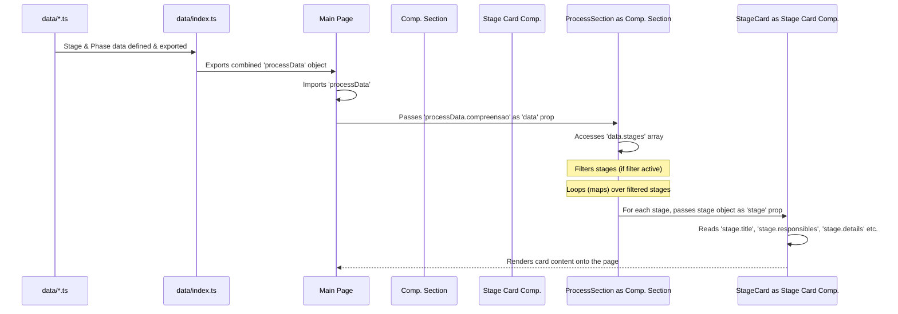

# Chapter 4: Product Process Data Structure

In the [previous chapter](03__stagecard__component_.md), we looked closely at the `StageCard` component – the little display panel that shows the details of a single step in our product development process. We saw how it receives a `stage` object via props and uses that information to show a title, icon, comments, and resource links.

But where does that `stage` object actually *come from*? How is all the information for *every* step, across *all* the phases ("Compreensão", "Definição", "Implementação"), organized so that our application can easily find and display it?

That's where the **Product Process Data Structure** comes in. It's the blueprint for how we store all the information about our process.

## The Organized Recipe Book

Imagine you have a big, detailed cookbook for building digital products with AI help. This cookbook isn't just a random collection of recipes; it's carefully organized.

*   **Sections:** The book is divided into major sections like "Understanding the Market" (`Compreensão`), "Designing the Solution" (`Definição`), and "Building the Product" (`Implementação`). There's also a special section on "Keeping Your Energy Up" (`Fôlego`) that runs alongside the main steps.
*   **Recipes:** Within each section, there are individual recipes, representing specific steps or stages (like "Analyse Market Trends" or "Define User Persona").
*   **Recipe Details:** Each recipe (stage) has:
    *   A clear **Title**.
    *   An **ID** number so you can easily find it.
    *   Information about **Who** does this step (Is it a chef? A sous-chef? A robot assistant? Or a chef *using* the robot assistant?). This is our `responsibles` field (e.g., "Humano", "IA", "Humano com assistência de IA").
    *   Detailed **Instructions** (`comment`).
    *   A list of **Ingredients and Tools** needed (`resources`), often grouped by type (like "Tools", "Prompts", "Examples") and sometimes including links to where to buy them (`url`).

Our **Product Process Data Structure** is exactly like this organized recipe book. It's a structured way to store all the information about each phase and stage, making it easy for our application components ([`ProductProcess`](01_main_page___productprocess___.md), [`ProcessSection`](02__processsection__component_.md), [`StageCard`](03__stagecard__component_.md)) to load the data and display it correctly.

## The Overall Structure

At the highest level, all our process data lives in a single JavaScript object, often called `processData`. This object is defined in `data/index.ts`.

```typescript
// File: data/index.ts (Simplified)

import { compreensaoData } from "./compreensao/index" // Data for Compreensão phase
import { definicaoData } from "./definicao/index"     // Data for Definição phase
import { implementacaoData } from "./implementacao/index" // Data for Implementação phase
import { folegoData } from "./folego.data"           // Data for Fôlego track

// The main object holding all process data
export const processData = {
  compreensao: compreensaoData,
  definicao: definicaoData,
  implementacao: implementacaoData,
  folego: folegoData,
};
```

**Explanation:**

*   We import specific data objects for each major part of the process (`compreensaoData`, `definicaoData`, etc.). These are defined in separate files/folders within the `data/` directory to keep things organized.
*   We then assemble them into one main `processData` object.
*   The keys (`compreensao`, `definicao`, `implementacao`, `folego`) correspond directly to the main sections displayed in the application.

The [Main Page (`ProductProcess`)](01_main_page___productprocess___.md) component imports this `processData` object. It then passes the relevant chunk (like `processData.compreensao`) to the corresponding [`ProcessSection`](02__processsection__component_.md) component.

## Structure of a Phase (e.g., `compreensao`)

Let's look inside one of the phase data objects, like `compreensaoData` (defined in `data/compreensao/index.ts`).

```typescript
// File: data/compreensao/index.ts (Simplified)

// Import data for each individual stage in this phase
import { mapeamentoInicialData } from "./1-mapeamento-inicial.data"
import { aprendizadoPublicoData } from "./2-aprendizado-publico.data"
// ... import other stage data files ...
import { evolucaoSolucaoData } from "./8-evolucao-solucao.data"

// The data object for the 'Compreensão' phase
export const compreensaoData = {
  title: "aprendizado do espaço do problema e solução", // Title for the section
  description: "etapas para compreender o espaço do problema...", // Description for the section
  stages: [ // An array containing all stage objects for this phase
    mapeamentoInicialData,
    aprendizadoPublicoData,
    // ... other imported stage objects ...
    evolucaoSolucaoData,
  ],
};
```

**Explanation:**

*   Each phase object (like `compreensaoData`) usually contains:
    *   `title`: The title displayed by the [`ProcessSection`](02__processsection__component_.md) header.
    *   `description`: The optional description shown when the section is expanded.
    *   `stages`: This is the most important part! It's an **array** (a list) where each item is an object representing a single stage in that phase. We import the data for each stage from its own file (e.g., `1-mapeamento-inicial.data.ts`) and put them in this array.

## Structure of a Single Stage (The Recipe Details)

Now, let's zoom in on the structure of one specific stage object, like `mapeamentoInicialData` from `data/compreensao/1-mapeamento-inicial.data.ts`. This is the data that eventually gets passed to a single [`StageCard`](03__stagecard__component_.md).

```typescript
// File: data/compreensao/1-mapeamento-inicial.data.ts (Simplified)

export const mapeamentoInicialData = {
  id: 1, // Unique number for this stage
  title: "mapeamento inicial", // Title shown on the StageCard
  type: "stage", // Usually 'stage'
  responsibles: ["humano com assistência de ia"], // Who does it? (Used for icons & filtering)
  details: { // An object holding more details
    comment: "mapeamento inicial do espaço do problema", // Text shown in the card body
    resources: [ // An array of resource groups
      { // First resource group
        title: "prompts", // Title of the group (e.g., "Tools", "Prompts")
        items: [ // An array of items within this group
          { // First item in the group
            name: "mapear o espaço do problema com jobs to be done", // Name of the resource
            url: "https://calirenato82...", // Optional link
          },
          // ... more items in this group ...
        ],
      },
      { // Second resource group
        title: "recursos",
        items: [ /* ... more items ... */ ],
      },
      // ... more resource groups ...
    ],
  },
};
```

**Explanation - Key Fields:**

*   `id`: A unique number. React uses this (`key={stage.id}`) when rendering lists of `StageCard`s.
*   `title`: The text displayed prominently at the top of the `StageCard`.
*   `responsibles`: An array containing one or more strings indicating who is responsible. The application typically looks at the *first* item in this array to:
    *   Choose the icon (User, Bot, UserCog).
    *   Decide if the card should be shown when a filter is active (e.g., if the filter is "IA", only stages where the first responsible is "IA" will be shown). We'll cover this in the [next chapter](05_filtering_logic_.md).
*   `details`: An object containing the descriptive content.
    *   `comment`: A string of text displayed in the main body of the `StageCard`.
    *   `resources`: An array of resource groups. Each group has:
        *   `title`: A heading for the group (like "Tools", "Prompts").
        *   `items`: An array of specific resources within that group. Each item has:
            *   `name`: The text displayed for the resource.
            *   `url`: (Optional) If present, the `name` becomes a clickable link opening this URL.

This detailed structure for each stage allows the [`StageCard`](03__stagecard__component_.md) to neatly display all the relevant information.

## How the Data Flows

Let's trace how this data gets from the files to the screen:



1.  **Definition:** Data for each stage and phase is defined in separate `.ts` files within the `data/` folder.
2.  **Aggregation:** `data/index.ts` imports all these pieces and combines them into the main `processData` object.
3.  **Loading:** The `ProductProcess` component imports `processData`.
4.  **Distribution:** `ProductProcess` passes specific slices of the data (e.g., `processData.compreensao`) to the appropriate child components (`ProcessSection`, `ImplementationSection`, `FolegoSection`) via the `data` prop.
5.  **Iteration:** The `ProcessSection` component receives its `data` prop, accesses the `stages` array within it, filters this array if needed, and then loops through each `stage` object in the array.
6.  **Delegation:** For each `stage` object, `ProcessSection` renders a `StageCard` component, passing that single `stage` object down as the `stage` prop.
7.  **Display:** The `StageCard` component receives the `stage` prop and uses the fields inside it (`title`, `details.comment`, `details.resources`, `responsibles`) to render the final card visible to the user.

## The `Fôlego` Data Structure

The data for the "Fôlego" section (`data/folego.data.ts`) is a bit simpler:

```typescript
// File: data/folego.data.ts (Simplified)

export const folegoData = {
  title: "fôlego",
  description: "atividades para manter o ritmo...",
  content: [ // A simple array of strings
    "projetos experimentais voluntários",
    "aprendizado e desenvolvimento contínuo",
    "retrospectiva do time/processo",
    // ... more strings ...
  ],
};
```

Instead of an array of complex `stage` objects, it has a simple `content` array containing strings. The [`FolegoSection` Component](06__folegosection__component_.md) just displays these strings as a list.

## Conclusion

The **Product Process Data Structure** is the backbone of our application's content. It's like the well-organized script or recipe book that defines every step of the product development process. By structuring the data into phases (`compreensao`, `definicao`, `implementacao`, `folego`) and individual stages (each with `id`, `title`, `responsibles`, `details`, etc.), we make it easy for our React components to load, manage, and display the information consistently.

Understanding this structure is key, especially because fields like `responsibles` are used not just for display but also for interactivity. In the next chapter, we'll explore exactly how the application uses the `responsibles` field in this data structure to implement the [Filtering Logic](05_filtering_logic_.md).

---

Generated by [AI Codebase Knowledge Builder](https://github.com/The-Pocket/Tutorial-Codebase-Knowledge)