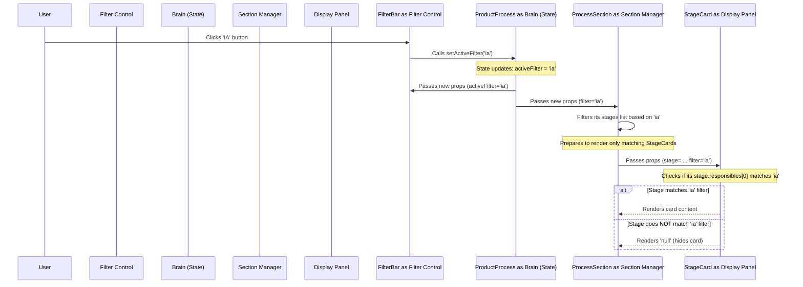

# Chapter 5: Filtering Logic

In the [previous chapter](04_product_process_data_structure_.md), we explored how all the information for our product process is organized, particularly the `responsibles` field in each stage's data, which tells us who performs that step (Human, AI, or Human+AI).

Now, imagine you're looking at the whole process map, but you only want to focus on the steps where Artificial Intelligence is involved. Or perhaps you only want to see the tasks assigned purely to humans. How can we temporarily hide the other steps to make the view clearer?

This is where **Filtering Logic** comes in! It's like having colored filters for a spotlight on a stage. You can choose a filter (like "AI") to shine the spotlight only on the actors (process stages) matching that color, while the others remain in the shadows.

## What is Filtering Logic?

Filtering Logic allows users to selectively view process stages based on who is responsible for them. It helps users focus on specific aspects of the process, such as:

*   Viewing only tasks performed by **Humans**.
*   Viewing only tasks performed primarily by **AI**.
*   Viewing only tasks where **Humans work with AI assistance**.

This makes the potentially complex process map easier to digest and analyze from different perspectives.

## The Filtering Team: Who Does What?

Implementing this filtering feature involves several components working together, like a coordinated team:

1.  **The Control Panel (`FilterBar` component):** This is what the user interacts with. It displays buttons for each filter option (Human, AI, Human+AI). Located in `components/filter-bar.tsx`.
2.  **The Brain (`ProductProcess` component):** This main page component holds the *memory* of which filter is currently active. It uses a React state variable called `activeFilter`. Located in `app/page.tsx`.
3.  **The Section Managers (`ProcessSection` and `ImplementationSection` components):** These components display the main phases and implementation tracks. They receive the current `activeFilter` from the Brain (`ProductProcess`). They use this information to decide which stage cards *might* be visible within their section and pass the filter down. Located in `components/process-section.tsx` and `components/implementation-section.tsx`.
4.  **The Display Panels (`StageCard` component):** Each card represents a single stage. It receives the `activeFilter` from its Section Manager. It then checks its own data (the `stage.responsibles` field we learned about in [Chapter 4](04_product_process_data_structure_.md)) against the filter. If it doesn't match, the card hides itself. Located in `components/stage-card.tsx`.

## How Filtering Works: A Step-by-Step Example

Let's trace what happens when you click the "IA" filter button:

1.  **Click:** You click the "IA" button inside the `FilterBar`.
2.  **Tell the Brain:** The `FilterBar` calls a function (`setActiveFilter`) given to it by `ProductProcess`. It tells `ProductProcess`, "The user wants to filter by 'IA'!".
3.  **Brain Remembers:** `ProductProcess` updates its `activeFilter` state to remember `"ia"`.
4.  **Update Everyone:** Because its state changed, `ProductProcess` re-renders itself and tells all its children (including `FilterBar`, `ProcessSection`, `ImplementationSection`) about the *new* `activeFilter` value by passing it down as a prop.
5.  **Section Managers Adapt:** Each `ProcessSection` and `ImplementationSection` receives the `filter="ia"` prop. They recalculate how many stages *might* match this filter (for their count badges) and prepare to display only those potentially matching stages.
6.  **Display Panels Decide:** The Section Managers pass the `filter="ia"` prop down to each `StageCard` they render. Each `StageCard` looks at its own `stage.responsibles` data.
    *   If a card's primary responsible is "IA", it shows itself.
    *   If a card's primary responsible is "Humano" or "Humano com assistência de ia", it hides itself (`return null`).
7.  **View Updates:** The page now shows only the `StageCard`s corresponding to AI tasks. The `FilterBar` also updates to show the "IA" button as selected.

## Looking at the Code

Let's see snippets of how this is implemented.

**1. The Control Panel (`FilterBar`)**

This component displays the buttons. When a button is clicked, it calls the `setActiveFilter` function (which it received as a prop from `ProductProcess`).

```typescript
// File: components/filter-bar.tsx (Simplified)

interface FilterBarProps {
  activeFilter: string | null // Tells which button is selected
  setActiveFilter: (filter: string | null) => void // Function to call on click
}

export function FilterBar({ activeFilter, setActiveFilter }: FilterBarProps) {
  const filters = [ /* ... filter definitions (Humano, IA, etc.) ... */ ];

  return (
    <div /* ... layout ... */ >
      <span /* ... label ... */ >Filtrar por:</span>
      {filters.map((filter) => (
        <button
          key={filter.id}
          // If this filter is already active, clicking again clears it (null).
          // Otherwise, set this filter as active.
          onClick={() => setActiveFilter(activeFilter === filter.id ? null : filter.id)}
          // Style changes if this filter is the active one
          className={`... ${ activeFilter === filter.id ? "bg-black text-white" : "..." }`}
        >
          {/* ... icon and label ... */}
        </button>
      ))}
      {/* Optional: Clear filter button */}
      {activeFilter && (
        <button onClick={() => setActiveFilter(null)} /* ... */ >
           {/* ... X icon ... */}
        </button>
      )}
    </div>
  );
}
```

**Explanation:**
*   It receives the current `activeFilter` to know which button to highlight.
*   It receives the `setActiveFilter` function to call when a button is clicked.
*   The `onClick` logic handles selecting a new filter or deselecting the current one.

**2. The Brain (`ProductProcess`)**

This component manages the `activeFilter` state and passes it down.

```typescript
// File: app/page.tsx (Simplified)
import { useState } from "react";
// ... other imports ...
import { FilterBar } from "@/components/filter-bar";
import { ProcessSection } from "@/components/process-section";
// ...

export default function ProductProcess() {
  // State variable to store the currently active filter ('ia', 'humano', etc. or null)
  const [activeFilter, setActiveFilter] = useState<string | null>(null);
  // ... other state like expandedSections ...

  return (
    <div /* ... page layout ... */ >
      {/* ... title, images ... */}

      {/* Render FilterBar, passing the state value and the function to update it */}
      <FilterBar activeFilter={activeFilter} setActiveFilter={setActiveFilter} />

      {/* ... other components ... */}

      {/* Render ProcessSections, passing the activeFilter down */}
      <ProcessSection
        // ... other props like title, data, isExpanded, onToggle ...
        filter={activeFilter} // Pass the current filter state
      />
      {/* ... other ProcessSections and ImplementationSection also receive filter={activeFilter} ... */}
    </div>
  );
}
```

**Explanation:**
*   `useState<string | null>(null)` creates the `activeFilter` state variable and the `setActiveFilter` function.
*   The `activeFilter` variable is passed as a prop named `filter` to `ProcessSection` and `ImplementationSection`.
*   Both `activeFilter` and `setActiveFilter` are passed as props to `FilterBar`.

**3. Section Managers (`ProcessSection`)**

Receives the filter, uses it to potentially filter stages *before* rendering cards, updates its count badge, and passes the filter down.

```typescript
// File: components/process-section.tsx (Simplified)
import { StageCard } from "./stage-card";

interface ProcessSectionProps {
  // ... other props ...
  data: any; // Contains { stages: [...] }
  filter: string | null; // Receives the active filter
}

export function ProcessSection({ /* ..., */ data, filter }: ProcessSectionProps) {
  const stages = data.stages || [];

  // Filter stages based on the active filter prop
  const filteredStages = filter
    ? stages.filter((stage: any) => {
        // Get the primary responsible party (e.g., "ia", "humano")
        const responsible = stage.responsibles?.[0]?.toLowerCase();
        // Check if it matches the filter (case-insensitive)
        return responsible === filter.toLowerCase();
      })
    : stages; // If no filter, use all stages

  // If filtering removed all stages, don't show this section at all
  if (filter && filteredStages.length === 0) {
    return null;
  }

  return (
    <div /* ... section layout ... */ >
      <button /* ... header button ... */ >
        {/* ... title, emoji ... */}
        {/* Display the count of *filtered* stages */}
        <span /* ... count badge ... */ >{filteredStages.length}</span>
        {/* ... chevron icon ... */}
      </button>

      {/* If expanded... */}
      {isExpanded && (
        <div /* ... content area ... */ >
          {/* ... description ... */}
          <div /* ... horizontal scroll area ... */ >
            {/* Map over the filtered stages */}
            {filteredStages.map((stage: any) => (
              // Render StageCard, passing the stage data AND the filter down
              <StageCard key={stage.id} stage={stage} filter={filter} />
            ))}
          </div>
        </div>
      )}
    </div>
  );
}
```

**Explanation:**
*   Receives the `filter` prop.
*   Calculates `filteredStages`: It creates a *new* list containing only the stages whose first `responsible` matches the `filter`. If `filter` is `null`, `filteredStages` is the same as the original `stages`.
*   The count badge in the header shows `filteredStages.length`.
*   If the `filter` is active and results in zero stages, the entire section hides itself (`return null`).
*   It maps over `filteredStages` (not the original `stages`) to render `StageCard`s.
*   Crucially, it passes the `filter` prop down to each `StageCard`.

*(Note: The [`ImplementationSection` Component](07__implementationsection__component_.md) works similarly but needs to handle filtering across its internal "Discovery" and "Delivery" tracks, summing up the counts and passing the filter down to its nested `ProcessSection`s).*

**4. The Display Panel (`StageCard`)**

This is where the final decision to show or hide happens for each individual stage.

```typescript
// File: components/stage-card.tsx (Simplified)

interface StageCardProps {
  stage: any; // The data for this specific stage
  filter: string | null; // The active filter passed down
}

export function StageCard({ stage, filter }: StageCardProps) {
  // Get the primary responsible party (e.g., "ia", "humano")
  const primaryResponsible = stage.responsibles?.[0]?.toLowerCase();

  // --- The Core Filtering Check ---
  // If a filter is active AND this card's responsible doesn't match...
  if (filter && primaryResponsible !== filter.toLowerCase()) {
    // ...then render absolutely nothing for this card.
    return null;
  }
  // --- End Filtering Check ---

  // If we reach here, the card should be shown. Render its content:
  return (
    <div /* ... card styling ... */ >
      {/* ... card header (icon, title) ... */}
      {/* ... card body (comment, resources) ... */}
    </div>
  );
}
```

**Explanation:**
*   Receives the `stage` data and the `filter` prop.
*   Gets the `primaryResponsible` from its `stage` data.
*   The `if` statement is the key: If `filter` is not `null` (meaning a filter is active) AND the `primaryResponsible` for *this card* does *not* match the active `filter`, the component immediately returns `null`. Rendering `null` in React means "draw nothing".
*   If the `if` condition is false (either no filter is active, or the card matches the filter), the code continues, and the card's content is rendered as usual.

## Visualizing the Flow

Here's a diagram showing how the components interact when the user clicks the "IA" filter:



## Conclusion

Filtering logic in this project is a great example of how different React components collaborate using **state** and **props**.

*   The `ProductProcess` component acts as the central source of truth, holding the `activeFilter` state.
*   The `FilterBar` allows the user to change that state.
*   The state change triggers a re-render, passing the `activeFilter` value down as props to section components (`ProcessSection`, `ImplementationSection`).
*   Section components use the filter prop to adjust their display (like counts) and decide which potential children to render.
*   Finally, each `StageCard` uses the filter prop and its own data to make the ultimate decision: show itself or hide.

This pattern of lifting state up (to `ProductProcess`) and passing data/functions down (via props) is fundamental to building interactive React applications.

In the next chapter, we'll look at a slightly different type of section component: the [`FolegoSection` Component](06__folegosection__component_.md), which displays parallel activities for maintaining team energy and focus.

---

Generated by [AI Codebase Knowledge Builder](https://github.com/The-Pocket/Tutorial-Codebase-Knowledge)