# Chapter 6: `FolegoSection` Component

In the [previous chapter](05_filtering_logic_.md), we saw how filtering helps us focus on specific parts of the main product development process, which is displayed using components like [`ProcessSection`](02__processsection__component_.md) and [`StageCard`](03__stagecard__component_.md). But product development isn't just about the core tasks; it's also about maintaining energy, learning, and improving the process itself.

Imagine the main product process as a busy assembly line ("Foco" - Focus). Sometimes, you need a separate space off to the side – maybe a workshop, a library, or a break room – for activities that support the main work but aren't directly part of building the *current* product feature. This could be for team meetings, learning new skills, or experimental side projects. How do we represent this "breather" or "stamina" space ("Fôlego") in our visual map?

That's the job of the `FolegoSection` component!

## Meet the Side Area

The `FolegoSection` component is designed specifically to display the "Fôlego" activities – things that help the team maintain pace and quality over the long run. Think of it as a **dedicated side panel** or **companion section** that sits alongside the main "Foco" production line.

Key characteristics:

1.  **Separate Activities:** It displays a list of activities (like "Retrospectivas", "Aprendizado Contínuo") that are distinct from the core product stages shown in `ProcessSection`.
2.  **Simpler Content:** It typically just shows a list of items, not detailed `StageCard`s with responsibles, comments, and resources. The data comes from `data/folego.data.ts` (covered in [Chapter 4: Product Process Data Structure](04_product_process_data_structure_.md)).
3.  **Unique Collapsible Design:** This is its most special feature!
    *   Like `ProcessSection`, it can be expanded or collapsed.
    *   **On larger screens (desktops):** When *collapsed*, it shrinks down into a very narrow vertical bar, showing just an icon and the rotated title ("fôlego"). When *expanded*, it takes up a moderate amount of width (like 1/5th of the available space) to show the list of activities. This makes it feel like a retractable sidebar.
    *   **On smaller screens (mobile):** It behaves more like a standard collapsible section, stacking vertically with other content.

## How `ProductProcess` Uses `FolegoSection`

The main page component, [`ProductProcess`](01_main_page___productprocess___.md), is responsible for placing the `FolegoSection` alongside the main process sections and managing its expanded/collapsed state.

Let's look at the simplified code in `app/page.tsx`:

```typescript
// File: app/page.tsx (Simplified)
// ... imports and other state ...
import { FolegoSection } from "@/components/folego-section";
import { processData } from "@/data";

export default function ProductProcess() {
  // State to track if Folego is expanded (managed by ProductProcess)
  const [isFolegoExpanded, setIsFolegoExpanded] = useState(false);
  // ... other state like expandedSections, activeFilter ...

  return (
    <div /* ... page layout ... */ >
      {/* ... title, filters, etc. ... */}

      {/* Main layout: Foco sections on left, Folego on right (on large screens) */}
      <div className="flex flex-col lg:flex-row gap-4 mb-8">
        {/* Container for the main 'Foco' sections */}
        <div /* ... focus section container ... */ >
          {/* ... ProcessSections for Compreensão, Definição, Implementação ... */}
        </div>

        {/* Render the Folego Section */}
        <FolegoSection
          data={processData.folego} // Pass the specific 'folego' data
          isExpanded={isFolegoExpanded} // Tell it whether to be expanded
          onToggle={() => setIsFolegoExpanded(!isFolegoExpanded)} // Give it the function to call when clicked
          emoji="🧘" // Pass an emoji for the header
        />
      </div>
      {/* ... other components ... */}
    </div>
  );
}
```

**Explanation:**

1.  **State:** `ProductProcess` uses `useState` to create `isFolegoExpanded` (which is `true` or `false`) and `setIsFolegoExpanded` (the function to change it).
2.  **Layout:** The `lg:flex-row` class arranges the "Foco" container and the `FolegoSection` side-by-side on large screens (`lg` breakpoint and up). On smaller screens, they stack (`flex-col`).
3.  **Rendering:** `ProductProcess` renders `<FolegoSection />` and passes it the necessary props:
    *   `data`: The specific part of `processData` related to Fôlego activities.
    *   `isExpanded`: The current value of the `isFolegoExpanded` state.
    *   `onToggle`: A simple function that calls `setIsFolegoExpanded` to flip the state between `true` and `false`.
    *   `emoji`: An optional emoji for the header.

## Inside `FolegoSection`: How it Works

Let's trace what the `FolegoSection` component (in `components/folego-section.tsx`) does.

**Scenario:** User clicks the Fôlego header.

```mermaid
sequenceDiagram
    participant User
    participant FolegoSection as Fôlego Section
    participant ProductProcess as Main Page

    User->>FolegoSection as Fôlego Section: Clicks header button
    Note over FolegoSection as Fôlego Section: Calls the 'onToggle' function received as a prop
    FolegoSection as Fôlego Section->>ProductProcess as Main Page: Calls setIsFolegoExpanded(!isFolegoExpanded)
    Note over ProductProcess as Main Page: Updates 'isFolegoExpanded' state (flips true/false)
    ProductProcess as Main Page->>ProductProcess as Main Page: Re-renders because state changed
    ProductProcess as Main Page->>FolegoSection as Fôlego Section: Re-renders, passing new 'isExpanded' prop value
    Note over FolegoSection as Fôlego Section: Adjusts width and content visibility based on new 'isExpanded' value
```



**Step-by-step:**

1.  **Receive Props:** The component gets `data`, `isExpanded`, `onToggle`, and `emoji` from `ProductProcess`.
2.  **Check Screen Size:** It uses a helper (like the `useIsMobile` hook seen in the code) to determine if the screen is considered "mobile" or "large". This helps decide *how* to display the collapsed state.
3.  **Render Container:** It renders the main `div` that holds everything. Critically, it applies conditional CSS classes for the width, based on the `isExpanded` prop and screen size. For example:
    *   If `isExpanded` is `true`, it might get `lg:w-1/5` (take 1/5th width on large screens).
    *   If `isExpanded` is `false`, it might get `lg:w-16` (take a fixed, narrow width of 16 units on large screens).
4.  **Render Header Button:** It renders a `<button>` that acts as the header.
    *   The `onClick` handler is set to the `onToggle` function received from `ProductProcess`.
    *   **Special Collapsed View (Large Screens):** If `isExpanded` is `false` AND the screen is large (`!isMobile`), it displays the content differently: the emoji and title ("fôlego") are rotated 90 degrees and centered in the narrow bar.
    *   **Normal View (Expanded or Mobile):** Otherwise, it displays the emoji, title, and a chevron icon normally.
5.  **Render Content:** It uses `{isExpanded && (...) }` to conditionally render the content *only* if `isExpanded` is `true`. The content includes:
    *   The `data.description` (if provided).
    *   An unordered list (`<ul>`) where it loops through the `data.content` array (which contains strings like "Retrospectiva do time/processo") and renders each string as a list item (`<li>`).

## A Peek at the `FolegoSection` Code

Here's a simplified look inside `components/folego-section.tsx`:

```typescript
// File: components/folego-section.tsx (Simplified)
"use client"

import { ChevronDown, ChevronRight } from "lucide-react";
import { useIsMobile } from "@/hooks/use-mobile"; // Helper to check screen size

// Define the expected props
interface FolegoSectionProps {
  data: any; // Contains { title, description, content: [...] }
  emoji?: string;
  isExpanded: boolean; // Current expansion state
  onToggle: () => void; // Function to call when clicked
}

export function FolegoSection({ data, emoji, isExpanded, onToggle }: FolegoSectionProps) {
  const isMobile = useIsMobile(); // Check if we're on a small screen

  return (
    // Main container: width changes based on isExpanded and screen size (lg)
    <div
      className={`
        border-4 border-black rounded-xl bg-white ...
        transition-all duration-300 flex flex-col // Animate width change
        ${isExpanded ? "lg:w-1/5" : "lg:w-16"} // <-- Key width change for large screens
      `}
    >
      {/* Clickable Header Button */}
      <button
        onClick={onToggle} // Call parent's toggle function
        className={`
          w-full font-bold text-xl flex items-center justify-between p-4
          ${isExpanded ? "border-b-2 border-black" : "h-full"} // Style changes
          hover:bg-gray-100 relative // Make position relative for absolute child
        `}
      >
        {/* Special Collapsed View for Large Screens */}
        {!isExpanded && !isMobile ? (
          <div className="absolute inset-0 flex items-center justify-center">
            <div className="transform rotate-90 flex flex-row text-center"> {/* Rotate text */}
              <ChevronDown size={20} /> { /* Icon (could adjust based on state) */ }
              {emoji && <span /* ... */ >{emoji}</span>}
              fôlego {/* Rotated title */}
            </div>
          </div>
        ) : (
          /* Normal Expanded or Mobile View */
          <>
            <div className="flex items-center gap-2">
              {emoji && <span /* ... */ >{emoji}</span>}
              <span>fôlego</span> {/* Normal title */}
            </div>
            {/* Chevron icon changes direction */}
            {isExpanded ? <ChevronRight className="rotate-180" size={20} /> : <ChevronDown size={20} />}
          </>
        )}
      </button>

      {/* Content Area: Only rendered if isExpanded is true */}
      {isExpanded && (
        <>
          {/* Optional Description */}
          {data.description && (
            <div className="p-4 text-sm border-b-2 border-black">
              <p>{data.description}</p>
            </div>
          )}

          {/* List of Folego Activities */}
          <div className="p-4 flex-grow overflow-y-auto">
            <ul className="list-disc pl-5 space-y-2">
              {/* Loop through the content array from data */}
              {data.content.map((item: string, index: number) => (
                <li key={index} className="text-sm">
                  {item} {/* Display each activity string */}
                </li>
              ))}
            </ul>
          </div>
        </>
      )}
    </div>
  );
}
```

**Key Code Points:**

*   **Conditional Width:** The `${isExpanded ? "lg:w-1/5" : "lg:w-16"}` part in the main `div`'s `className` uses Tailwind CSS classes to dynamically change the width on large (`lg`) screens based on the `isExpanded` prop. The `transition-all` class makes this change smooth.
*   **Conditional Header:** The `{!isExpanded && !isMobile ? (...) : (...) }` block checks if the section is collapsed *and* if it's not a mobile screen. If both are true, it renders the special rotated view; otherwise, it renders the standard header.
*   **Conditional Content:** The `{isExpanded && (...) }` block ensures the description and the list of activities are only rendered when the section is expanded.
*   **Data Mapping:** `data.content.map(...)` iterates over the simple array of strings provided in `data.content` and creates a list item (`<li>`) for each one.

## Conclusion

The `FolegoSection` component provides a dedicated space in the UI for auxiliary "Fôlego" activities, keeping them visually distinct from the main "Foco" process flow. Its most notable feature is the unique collapsing behavior on large screens, where it transforms into a narrow, icon-based sidebar, offering an elegant way to tuck away secondary information while keeping it accessible. It uses state managed by the parent [`ProductProcess`](01_main_page___productprocess___.md) component and displays simpler list-based data from `data/folego.data.ts`.

Now that we've seen the main process sections (`ProcessSection`), the side activities section (`FolegoSection`), and how filtering works, let's look at a specialized section used within the main flow: the [Chapter 7: `ImplementationSection` Component](07__implementationsection__component_.md), which has its own internal structure for handling Discovery and Delivery tracks.

---

Generated by [AI Codebase Knowledge Builder](https://github.com/The-Pocket/Tutorial-Codebase-Knowledge)