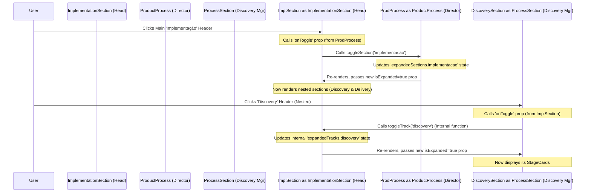

# Chapter 7: `ImplementationSection` Component

In the [previous chapter](06__folegosection__component_.md), we learned about the `FolegoSection`, a component designed for displaying auxiliary activities alongside the main process. Now, let's turn our attention back to the core product development flow, specifically the "Implementação" (Implementation) phase.

You might have noticed that the Implementation phase is a bit different. It's often broken down into parallel activities: discovering the finer details of *what* to build next (`Discovery`) and actually building and delivering it (`Delivery`). How do we represent a main phase that *itself contains sub-phases* or tracks?

This is where the `ImplementationSection` component comes in. It's a specialized section manager designed specifically for the "Implementação" phase.

## Meet the Section with Sub-Sections

Think of the main process phases ("Compreensão", "Definição", "Implementação") as major departments in a company. [`ProcessSection`](02__processsection__component_.md) is like the manager for a standard department. However, the "Implementação" department is large and has two distinct teams working simultaneously: the "Discovery" team and the "Delivery" team.

The `ImplementationSection` component acts like the **Head of the Implementation Department**. Its job is to:

1.  **Represent the Whole Department:** Display the main title ("Implementação") and description for the entire phase.
2.  **Manage Overall Access:** Control whether the entire Implementation department's details are shown or hidden (its own expand/collapse state).
3.  **Contain Sub-Team Managers:** Instead of directly managing individual employee tasks (`StageCard`s), it manages the managers of the sub-teams ("Discovery" and "Delivery"). It actually uses the standard [`ProcessSection`](02__processsection__component_.md) component *inside* itself to represent these sub-teams!
4.  **Coordinate Information:** It passes down the correct tasks (data) and any company-wide directives (like an active `filter`) to the appropriate sub-team manager (`ProcessSection`).
5.  **Report Overall Status:** It calculates and displays the *total* number of active tasks across *both* sub-teams (Discovery and Delivery), respecting any active filters.

## What `ImplementationSection` Needs (Props)

Just like `ProcessSection`, `ImplementationSection` receives instructions from the main director, [`ProductProcess`](01_main_page___productprocess___.md), via props:

*   `title`: (Text) The name of the main phase ("implementação").
*   `emoji`: (Text, Optional) An emoji for the main header ("🛠️").
*   `description`: (Text, Optional) A description of the overall implementation phase.
*   `isExpanded`: (Boolean) Whether this *main* implementation section should be open or closed (controlled by `ProductProcess`).
*   `onToggle`: (Function) The function to call when the *main* implementation header is clicked (provided by `ProductProcess`).
*   `data`: (Object) The data specifically for the implementation phase. Critically, this data itself contains sub-objects for `discovery` and `delivery` tracks (e.g., `data.tracks.discovery`, `data.tracks.delivery`). See [Chapter 4: Product Process Data Structure](04_product_process_data_structure_.md).
*   `filter`: (Text or `null`) The currently active filter ("IA", "Humano", etc.), passed down from `ProductProcess`.

## How `ProductProcess` Uses `ImplementationSection`

In `app/page.tsx`, `ProductProcess` uses `ImplementationSection` just like it uses `ProcessSection`, passing the relevant props:

```typescript
// File: app/page.tsx (Simplified Usage)

// (Inside the ProductProcess component)
// ... state variables: expandedSections, activeFilter ...
// ... toggleSection function defined ...

<ImplementationSection
  title="implementação"                  // Main title prop
  emoji="🛠️"                            // Emoji prop
  description={processData.implementacao.description} // Overall description
  isExpanded={expandedSections.implementacao} // Controlled by ProductProcess state
  onToggle={() => toggleSection("implementacao")} // Tells ProductProcess to toggle *this* section
  data={processData.implementacao}      // Passes the implementacao data object
  filter={activeFilter}               // Passes the current filter state
/>
```

Notice that it receives the `implementacao` slice of the `processData`. This `implementacaoData` object internally contains the `tracks` object with data for `discovery` and `delivery`.

## Inside `ImplementationSection`: Nested Management

Here's the clever part: `ImplementationSection` acts as both a section *and* a manager of other sections.

1.  **Receive Props:** Gets instructions (`data`, `isExpanded`, `onToggle`, `filter`, etc.) from `ProductProcess`.
2.  **Manage Nested State:** It uses *its own internal state* (using React's `useState`) to keep track of whether the nested "Discovery" track is expanded and whether the nested "Delivery" track is expanded. Let's call this state `expandedTracks`.
3.  **Display Main Header:** Shows the main "Implementação" title, emoji, and a total count badge. This count is calculated by looking at *both* the Discovery stages and the Delivery stages inside its `data` prop, and applying the `filter` if one is active. The header button uses the `onToggle` prop from `ProductProcess` to expand/collapse the *entire* Implementation section.
4.  **Check if Main Section is Expanded:** Looks at the `isExpanded` prop received from `ProductProcess`.
5.  **If Main Section is Expanded:**
    *   It renders the overall `description`.
    *   It renders two instances of the [`ProcessSection` Component](02__processsection__component_.md):
        *   **First `ProcessSection` (for Discovery):**
            *   It passes `data.tracks.discovery.title` as the `title`.
            *   It passes `data.tracks.discovery` as the `data`.
            *   It passes `expandedTracks.discovery` (its internal state) as `isExpanded`.
            *   It passes its *own internal function* (`toggleTrack("discovery")`) as `onToggle`, so clicking this nested section only changes `ImplementationSection`'s internal state.
            *   It passes the `filter` prop it received down to this nested section.
        *   **Second `ProcessSection` (for Delivery):**
            *   It does the same, but uses `data.tracks.delivery` and controls its expansion using `expandedTracks.delivery` and `toggleTrack("delivery")`.
6.  **If Main Section is Closed:** It doesn't render the description or the nested `ProcessSection` components.

## Visualizing the Interaction

Let's see how expanding works, first the main section, then a nested one:



## A Peek at the `ImplementationSection` Code

Here's a simplified view of `components/implementation-section.tsx`:

```typescript
// File: components/implementation-section.tsx (Simplified)
"use client"

import { ChevronDown } from "lucide-react"
import { ProcessSection } from "./process-section" // It uses ProcessSection inside!
import { useState } from "react" // Needs its own state for nested sections

// Props received from ProductProcess
interface ImplementationSectionProps {
  title: string
  emoji?: string
  description?: string
  isExpanded: boolean // For the *main* section
  onToggle: () => void // To toggle the *main* section
  data: any // Contains { tracks: { discovery: {...}, delivery: {...} } }
  filter: string | null
}

export function ImplementationSection({
  title, emoji, description, isExpanded, onToggle, data, filter,
}: ImplementationSectionProps) {

  // Internal state to manage expansion of nested tracks
  const [expandedTracks, setExpandedTracks] = useState<Record<string, boolean>>({
    discovery: false,
    delivery: false,
  })

  // Internal function to toggle nested tracks
  const toggleTrack = (track: string) => {
    setExpandedTracks((prev) => ({ ...prev, [track]: !prev[track] }))
  }

  // Function to calculate total stages in *both* tracks, respecting filter
  const getTotalStages = () => {
    let total = 0
    // Loop through data.tracks.discovery.stages and data.tracks.delivery.stages
    // Count stages, applying filter logic if filter is active
    // Simplified: Assume it correctly calculates the total count
    const discoveryStages = data.tracks.discovery?.stages || []
    const deliveryStages = data.tracks.delivery?.stages || []
    const allStages = [...discoveryStages, ...deliveryStages]

    if (!filter) return allStages.length;

    return allStages.filter(stage => stage.responsibles?.[0]?.toLowerCase() === filter.toLowerCase()).length;
  }

  const totalStages = getTotalStages()

  // If filtering hides everything, hide the whole section
  if (filter && totalStages === 0) {
    return null
  }

  return (
    <div className="border-2 border-black rounded-lg mb-4 overflow-hidden ...">
      {/* Main Header Button (controls the whole Implementation section) */}
      <button onClick={onToggle} /* ... styling ... */ >
        <div /* ... title, emoji ... */ >
          {title}
          {/* Display the *total* stage count for both tracks */}
          <span /* ... count badge ... */ >{totalStages}</span>
        </div>
        <ChevronDown className={`... ${isExpanded ? "rotate-180" : ""}`} />
      </button>

      {/* Content shown only if the MAIN section is expanded */}
      {isExpanded && (
        <div className="border-t-2 border-black">
          {description && <p /* ... */ >{description}</p>}

          {/* Render the nested ProcessSections */}
          <div className="p-4">
            {/* Nested Section for Discovery */}
            <ProcessSection
              title={data.tracks.discovery.title}
              emoji="🔬"
              description={data.tracks.discovery.description}
              // Use internal state for its expansion
              isExpanded={expandedTracks.discovery}
              // Use internal toggle function
              onToggle={() => toggleTrack("discovery")}
              // Pass the specific discovery data
              data={data.tracks.discovery}
              // Pass the filter down
              filter={filter}
            />

            {/* Nested Section for Delivery */}
            <ProcessSection
              title={data.tracks.delivery.title}
              emoji="🚚"
              description={data.tracks.delivery.description}
              // Use internal state for its expansion
              isExpanded={expandedTracks.delivery}
              // Use internal toggle function
              onToggle={() => toggleTrack("delivery")}
              // Pass the specific delivery data
              data={data.tracks.delivery}
              // Pass the filter down
              filter={filter}
            />
          </div>
        </div>
      )}
    </div>
  )
}
```

**Explanation:**

1.  **Internal State:** `useState` creates `expandedTracks` to hold `discovery: false` and `delivery: false` initially. `toggleTrack` updates this internal state.
2.  **Total Count:** `getTotalStages` sums up stage counts from `data.tracks.discovery.stages` and `data.tracks.delivery.stages`, applying the `filter` logic. This total is shown in the main header badge.
3.  **Main Header:** The main `<button>` uses the `onToggle` prop from `ProductProcess`. Clicking it expands/collapses the entire `ImplementationSection`.
4.  **Conditional Content:** `{isExpanded && ...}` ensures nested sections only appear if the main section is expanded.
5.  **Nested `ProcessSection`s:** Two instances of `ProcessSection` are rendered inside. Notice how they receive:
    *   Data specific to their track (`data.tracks.discovery` or `data.tracks.delivery`).
    *   Expansion state from the *internal* `expandedTracks` state.
    *   The `onToggle` prop is set to the *internal* `toggleTrack` function.
    *   The `filter` prop is passed down unchanged.

## Conclusion

The `ImplementationSection` component is a clever example of component composition. It acts as a specialized container for the "Implementação" phase, managing its own display and expansion. Crucially, it *uses* the [`ProcessSection` Component](02__processsection__component_.md) internally to render its nested "Discovery" and "Delivery" tracks, demonstrating how you can build complex UI structures by combining simpler, reusable components. It manages the state for these nested sections and correctly passes data and filter information down the chain.

We've now covered all the major custom components that structure our process visualization! These components rely heavily on a UI library for their appearance (buttons, cards, tooltips, icons). In the next chapter, we'll briefly introduce the library used: [Chapter 8: Shadcn/UI Component Library](08_shadcn_ui_component_library_.md).

---

Generated by [AI Codebase Knowledge Builder](https://github.com/The-Pocket/Tutorial-Codebase-Knowledge)