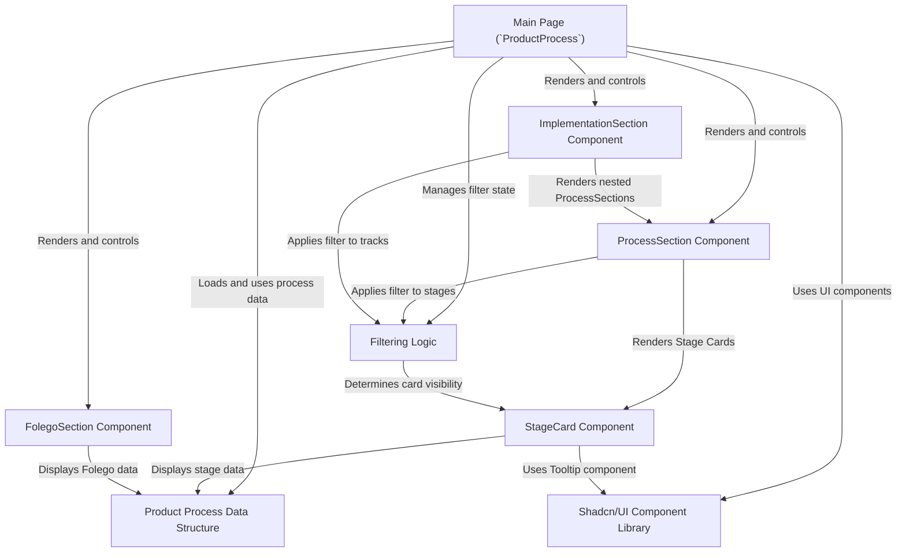

# Tutorial: processo-produto-foco-folego-ia

This project displays a detailed **product development process**, breaking it down into distinct phases like *Compreensão* (Understanding), *Definição* (Definition), and *Implementação* (Implementation), plus a parallel *Fôlego* (Stamina) track.
It visually represents each **stage** as a card, showing details and indicating whether the stage is primarily handled by a *Human*, *AI*, or *Human assisted by AI*.
Users can **filter** the view to see only stages assigned to a specific responsible party. The interface is built using the **Shadcn/UI** component library for a consistent look and feel.

**Source Repository:** [None](None)

## Chapters

1. [Main Page (`ProductProcess`)
](01_main_page___productprocess___.md)
2. [`ProcessSection` Component
](02__processsection__component_.md)
3. [`StageCard` Component
](03__stagecard__component_.md)
4. [Product Process Data Structure
](04_product_process_data_structure_.md)
5. [Filtering Logic
](05_filtering_logic_.md)
6. [`FolegoSection` Component
](06__folegosection__component_.md)
7. [`ImplementationSection` Component
](07__implementationsection__component_.md)
8. [Shadcn/UI Component Library
](08_shadcn_ui_component_library_.md)

---

Generated by [AI Codebase Knowledge Builder](https://github.com/The-Pocket/Tutorial-Codebase-Knowledge)
